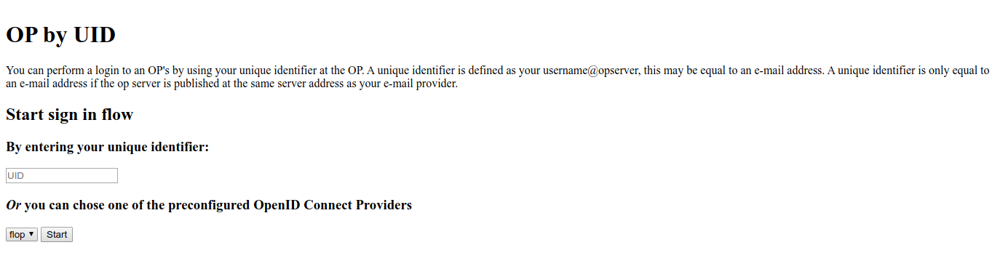
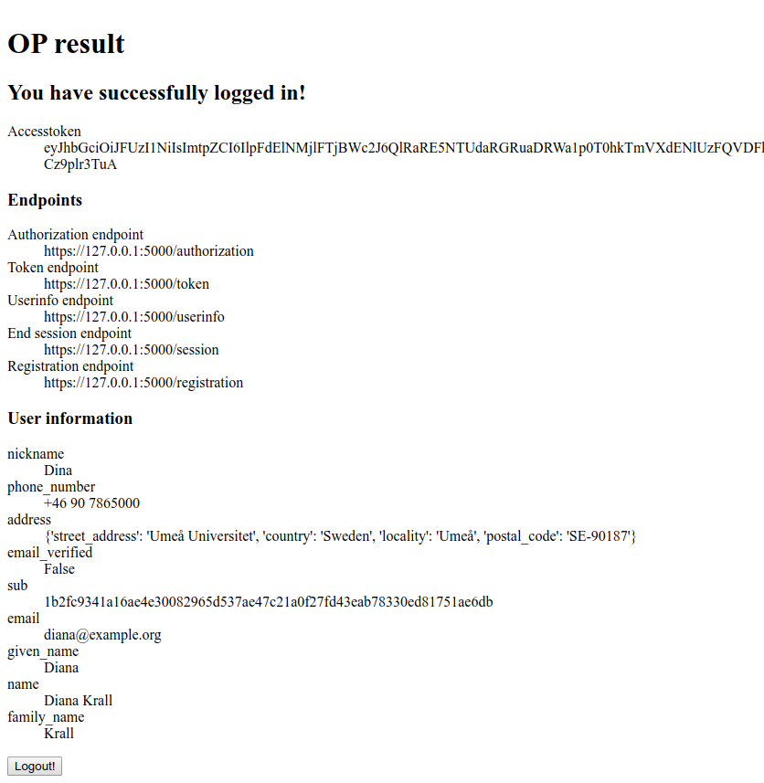

# oidc-op
Examples of a OIDC OPs with CherryPy, Flask and Django.
**NOT** something you should even image running in a production environment.


### Introduction

This project are here to show you how to 'build' an OP using the
classes and functions provided by oidcendpoint.

If you are just going to build a standard OP you only have to write the
configuration file. If you want to add or replace functionality this document
should be able to tell you how.

Setting up an OP means making a number if decisions. Like, should the OP support:

- [Web Finger](https://openid.net/specs/openid-connect-discovery-1_0.html#IssuerDiscovery)
- [dynamic discovery](https://openid.net/specs/openid-connect-discovery-1_0.html#ProviderConfig)
- [dynamic client registration](https://openid.net/specs/openid-connect-registration-1_0.html)

All these are services you can access at endpoints. The total set of endpoints
that this package supports are

- webfinger
- provider_info
- registration
- authorization
- token
- refresh_token
- userinfo
- end_session


### Configuration directives


_issuer_

The issuer ID of the OP, unique value.

_capabilities_

This covers most of the basic functionality of the OP. The key words are the
same as defined in
https://openid.net/specs/openid-connect-discovery-1_0.html#ProviderMetadata .
A couple of things are defined else where. Like the endpoints, issuer id,
jwks_uri and the authentication methods at the token endpoint.

An example:

    response_types_supported:
        - code
        - token
        - id_token
        - "code token"
        - "code id_token"
        - "id_token token"
        - "code id_token token"
        - none
      response_modes_supported:
        - query
        - fragment
        - form_post
      subject_types_supported:
        - public
        - pairwise
      grant_types_supported:
        - authorization_code
        - implicit
        - urn:ietf:params:oauth:grant-type:jwt-bearer
        - refresh_token
      claim_types_supported:
        - normal
        - aggregated
        - distributed

      claims_parameter_supported: True
      request_parameter_supported: True
      request_uri_parameter_supported: True
      frontchannel_logout_supported: True
      frontchannel_logout_session_supported: True
      backchannel_logout_supported: True
      backchannel_logout_session_supported: True
      check_session_iframe: https://127.0.0.1:5000/check_session_iframe


_id_token_

Defines which class that handles creating an ID Token and possibly also
arguments used when initiating that class.

An example:

    id_token:
      class: oidcendpoint.id_token.IDToken
      kwargs:
        default_claims:
          email:
            essential: True
          email_verified:
            essential: True


### OIDC Provider example setup

Create an environment
````
virtualenv -ppython3 env
source env/bin/activate
````

##### Install oidc-op
````
pip install git+https://github.com/rohe/oidc-op.git

# get the usage examples
git clone https://github.com/rohe/oidc-op.git
````

##### Configure a Django OP
````
cd oidc-op/django-oidc-op
pip install -r requirements.txt

cd example
pip install -r requirements.txt

./manage.py migrate
./manage.py createsuperuser
./manage.py collectstatic

gunicorn example.wsgi -b0.0.0.0:8000 --keyfile=./data/oidc_op/certs/key.pem --certfile=./data/oidc_op/certs/cert.pem --reload


````

##### Configure a Flask OP

````
pip install flask
cd oidc-op/

# configuration: create a private folder
cp -R flask_op/private .

# copy required files
cp flask_op/passwd.json private/
cp flask_op/conf.yaml private/
cp -R flask_op/templates .

# create a JWK for cookie signing
jwkgen --kty=SYM --kid cookie > private/cookie_sign_jwk.json
````

##### About JWK Set (JWKS) files
see: https://cryptojwt.readthedocs.io/en/latest/keyhandling.html

You can use `cryptojwt.key_jar.init_key_jar` to create JWKS file.
An easy way can be to configure the auto creation of JWKS files directly in your conf.yaml file.
Using `read_only: False` in `OIDC_KEYS` it will create the path within the JWKS files.
Change it to `True` if you don't want to overwrite them on each execution.

````
# in conf.yaml
#
OIDC_KEYS:
    'private_path': './private/jwks.json'
    'key_defs': *keydef
    'public_path': './static/jwks.json'
    # this will create the jwks files if they absent
    'read_only': False
````

In the JWTConnect-Python-CryptoJWT distribution there is also a script you can use to construct a JWK.

You can for instance do:
````
$ jwkgen --kty=RSA
{
    "d": "b9ucfay9vxDvz_nRZMVSUR9eRvHNMo0tc8Bl7tWkwxTis7LBXxmbMH1yzLs8omUil_u2a-Z_6VlKENxacuejYYcOhs6bfaU3iOqJbGi2p4t2i1oxjuF-cX6BZ5aHB5Wfb1uTXXobHokjcjVVDmBr_fNYBEPtZsVYqyN9sR9KE_ZLHEPks3IER09aX9G3wiB_PgcxQDRAl72qucsBz9_W9KS-TVWs-qCEqtXLmx9AAN6P8SjUcHAzEb0ZCJAYCkVu34wgNjxVaGyYN1qMA-1iOOVz--wtMyBwc5atSDBDgUApxFyj_DHSeBl81IHedcPjS9azxqFhumP7oJJyfecfSQ",
    "e": "AQAB",
    "kid": "cHZQbWRrMzRZak53U1pfSUNjY0dKd2xXaXRKenktdUduUjVBVTl3VE5ndw",
    "kty": "RSA",
    "n": "73XCXV2iiubSCEaFe26OpVnsBFlXwXh_yDCDyBqFgAFi5WdZTpRMJZoK0nn_vv2MvrXqFnw6IfXkwdsRGlMsNldVy36003gKa584CNksxfenwJZcF-huASUrSJEFr-3c0fMT_pLyAc7yf3rNCdRegzbBXSvIGKQpaeIjIFYftAPd9tjGA_SuYWVQDsSh3MeGbB4wt0lArAyFZ4f5o7SSxSDRCUF3ng3CB_QKUAaDHHgXrcNG_gPpgqQZjsDJ0VwMXjFKxQmskbH-dfsQ05znQsYn3pjcd_TEZ-Yu765_L5uxUrkEy_KnQXe1iqaQHcnfBWKXt18NAuBfgmKsv8gnxQ",
    "p": "_RPgbiQcFu8Ekp-tC-Kschpag9iaLc9aDqrxE6GWuThEdExGngP_p1I7Qd7gXHHTMXLp1c4gH2cKx4AkfQyKny2RJGtV2onQButUU5r0gwnlqqycIA2Dc9JiH85PX2Z889TKJUlVETfYbezHbKhdsazjjsXCQ6p9JfkmgfBQOXM",
    "q": "8jmgnadtwjMt96iOaoL51irPRXONO82tLM2AAZAK5Obsj23bZ9LFiw2Joh5oCSFdoUcRhbbIhCIv2aT4T_XKnDGnddrkxpF5Xgu0-hPNYnJx5m4kuzerot4j79Tx6qO-bshaaGz50MHs1vHSeFaDVN4fvh_hDWpV1BCNI0PKK-c"
}
SHA-256: pvPmdk34YjNwSZ_ICccGJwlWitJzy-uGnR5AU9wTNgw
````


##### Run the server
````
python -m flask_op.server private/conf.yaml
````

Then open your browser to `https://127.0.0.1:5000/.well-known/openid-configuration` to get the OpenID Provider Configuration resource.


##### Install OidcRP and configure flask-rp

It uses `JWTConnect-Python-OidcRP` as Relaing Party for tests, see [related page](https://github.com/openid/JWTConnect-Python-OidcRP).
You can run a working instance of `JWTConnect-Python-OidcRP.flask_rp` with:

````
pip install git+https://github.com/openid/JWTConnect-Python-OidcRP.git

# get entire project to have examples files
git clone https://github.com/openid/JWTConnect-Python-OidcRP.git
cd JWTConnect-Python-OidcRP

# run it as it come
python3 -m flask_rp.wsgi flask_rp/conf.yaml

# if you use django_op
RP_LOGFILE_NAME="./flrp.django.log" python3 -m flask_rp.wsgi django_op/example/data/oidc_rp/conf.django.yaml
````

Now you can connect to `https://127.0.0.1:8090/` to see the RP landing page and select your authentication endpoint.


### Authentication examples



Get to the RP landing page to choose your authentication endpoint. The first option aims to use _Provider Discovery_.

----------------------------------


AS/OP accepted our authentication request and prompt to us the login form. Read passwd.json file to get credentials.

----------------------------------



The identity representation with the information fetched from the user info endpoint.

----------------------------------


We can even test the single logout
