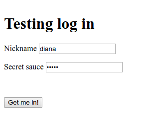
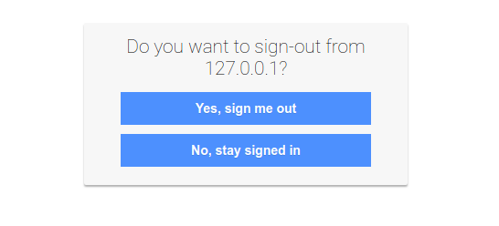

Usage
-----

Some examples, how to run [flask_op](https://github.com/IdentityPython/oidc-op/tree/master/example/flask_op) and [django_op](https://github.com/peppelinux/django-oidc-op) but also some typical configuration in relation to common use cases.


Configure flask-rp
------------------

_JWTConnect-Python-OidcRP_ is Relaing Party for tests, see [related page](https://github.com/openid/JWTConnect-Python-OidcRP).
You can run a working instance of `JWTConnect-Python-OidcRP.flask_rp` with:

````
pip install git+https://github.com/openid/JWTConnect-Python-OidcRP.git

# get entire project to have examples files
git clone https://github.com/openid/JWTConnect-Python-OidcRP.git
cd JWTConnect-Python-OidcRP/example/flask_rp

# run it as it come
bash run.sh
````

Now you can connect to `https://127.0.0.1:8090/` to see the RP landing page and select your authentication endpoint.

### Authentication examples


Get to the RP landing page to choose your authentication endpoint. The first option aims to use _Provider Discovery_.

----------------------------------



The AS/OP supports dynamic client registration, it accepts the authentication request and prompt to us the login form. Read [passwd.json](https://github.com/IdentityPython/oidc-op/blob/master/example/flask_op/passwd.json) file to get credentials.

----------------------------------


The identity representation with the information fetched from the user info endpoint.

----------------------------------



We can even test the single logout


Refresh token
-------------

To obtain a refresh token, you have to use `response_type=code`, add `offline_access` to `scope` and also use `prompt=consent`, otherwise there will be an error (based on [OpenID Connect specification](https://openid.net/specs/openid-connect-core-1_0.html#rfc.section.11)).

To refresh a token:


    import requests

    CLIENT_ID = "DBP60x3KUQfCYWZlqFaS_Q"
    CLIENT_SECRET="8526270403788522b2444e87ea90c53bcafb984119cec92eeccc12f1"
    REFRESH_TOKEN = "Z0FBQUFBQ ... lN2JNODYtZThjMnFsZUNDcg=="

    data = {
        "grant_type" : "refresh_token",
        "client_id" : f"{CLIENT_ID}",
        "client_secret" : f"{CLIENT_SECRET}",
        "refresh_token" : f"{REFRESH_TOKEN}"
    }
    headers = {'Content-Type': "application/x-www-form-urlencoded" }
    response = requests.post(
        'https://127.0.0.1:8000/oidcop/token', verify=False, data=data, headers=headers
    )

oidc-op will return a json response like this:

    {
     'access_token': 'eyJhbGc ... CIOH_09tT_YVa_gyTqg',
     'token_type': 'Bearer',
     'scope': 'openid profile email address phone offline_access',
     'refresh_token': 'Z0FBQ ... 1TE16cm1Tdg=='
    }


Introspection endpoint
----------------------

Here an example about how to consume oidc-op introspection endpoint.
This example uses a client with an HTTP Basic Authentication::

    import base64
    import requests

    TOKEN = "eyJhbGciOiJFUzI1NiIsImtpZCI6IlQwZGZTM1ZVYUcxS1ZubG9VVTQwUXpJMlMyMHpjSHBRYlMxdGIzZ3hZVWhCYzNGaFZWTlpTbWhMTUEifQ.eyJzY29wZSI6IFsib3BlbmlkIiwgInByb2ZpbGUiLCAiZW1haWwiLCAiYWRkcmVzcyIsICJwaG9uZSJdLCAiYXVkIjogWyJvTHlSajdzSkozWHZBWWplRENlOHJRIl0sICJqdGkiOiAiOWQzMjkzYjZiYmNjMTFlYmEzMmU5ODU0MWIwNzE1ZWQiLCAiY2xpZW50X2lkIjogIm9MeVJqN3NKSjNYdkFZamVEQ2U4clEiLCAic3ViIjogIm9MeVJqN3NKSjNYdkFZamVEQ2U4clEiLCAic2lkIjogIlowRkJRVUZCUW1keGJIVlpkRVJKYkZaUFkxQldaa0pQVUVGc1pHOUtWWFZ3VFdkZmVEY3diMVprYmpSamRrNXRMVzB4YTNnelExOHlRbHBHYTNRNVRHZEdUUzF1UW1sMlkzVnhjRE5sUm01dFRFSmxabGRXYVhJeFpFdHVSV2xtUzBKcExWTmFaRzV3VjJodU0yNXlSbTU0U1ZWVWRrWTRRM2x2UWs1TlpVUk9SazlGVlVsRWRteGhjWGx2UWxWRFdubG9WbTFvZGpORlVUSnBkaTFaUTFCcFptZFRabWRDVWt0YVNuaGtOalZCWVhkcGJFNXpaV2xOTTFCMk0yaE1jMDV0ZGxsUlRFc3dObWxsYUcxa1lrTkhkemhuU25OaWFWZE1kVUZzZDBwWFdWbzFiRWhEZFhGTFFXWTBPVzl5VjJOUk4zaGtPRDA9IiwgInR0eXBlIjogIlQiLCAiaXNzIjogImh0dHBzOi8vMTI3LjAuMC4xOjgwMDAiLCAiaWF0IjogMTYyMTc3NzMwNSwgImV4cCI6IDE2MjE3ODA5MDV9.pVqxUNznsoZu9ND18IEMJIHDOT6_HxzoFiTLsniNdbAdXTuOoiaKeRTqtDyjT9WuUPszdHkVjt5xxeFX8gQMuA"

    data = {
     'token': TOKEN,
     'token_type_hint': 'access_token'
    }

    _basic_secret = base64.b64encode(
        f'{"oLyRj7sJJ3XvAYjeDCe8rQ"}:{"53fb49f2a6501ec775355c89750dc416744a3253138d5a04e409b313"}'.encode()
    )
    headers = {
        'Authorization': f"Basic {_basic_secret.decode()}"
    }

    requests.post('https://127.0.0.1:8000/introspection', verify=False, data=data, headers=headers)


oidc-op will return a json response like this::

    {
      "active": true,
      "scope": "openid profile email address phone",
      "client_id": "oLyRj7sJJ3XvAYjeDCe8rQ",
      "token_type": "access_token",
      "exp": 0,
      "iat": 1621777305,
      "sub": "a7b0dea2958aec275a789d7d7dc8e7d09c6316dd4fc6ae92742ed3297e14dded",
      "iss": "https://127.0.0.1:8000",
      "aud": [
        "oLyRj7sJJ3XvAYjeDCe8rQ"
      ]
    }
