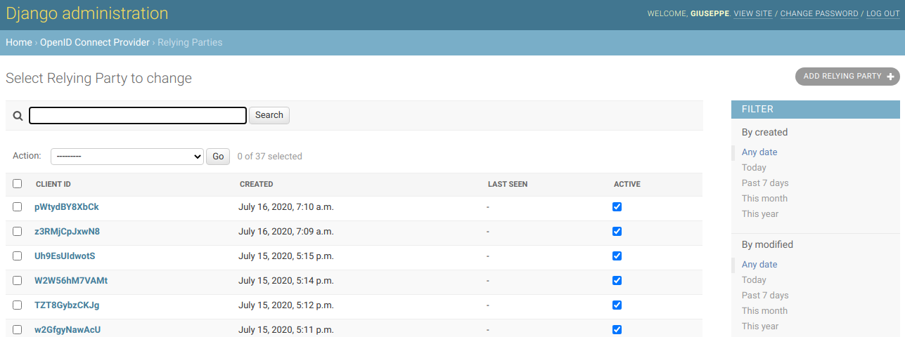
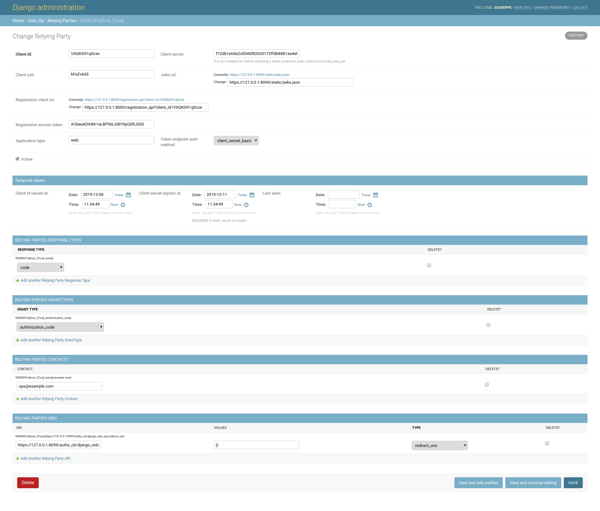
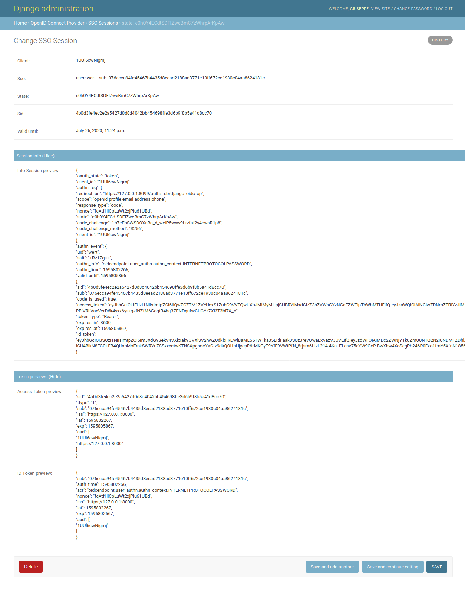

# django-oidc-op
A Django implementation of an **OIDC Provider** on top of [jwtconnect.io](https://jwtconnect.io/).
To configure a standard OIDC Provider you have to edit the oidcop configuration file.
See `example/example/oidc_op.conf.yaml` to get in.

This project is based on [Roland Hedberg's oidc-op](https://github.com/rohe/oidc-op).
Oidcendpoint supports the following standards and drafts:

- [OpenID Connect Core 1.0 incorporating errata set 1](https://openid.net/specs/openid-connect-core-1_0.html)
- [OpenID Connect Discovery 1.0 incorporating errata set 1](https://openid.net/specs/openid-connect-discovery-1_0.html)
- [OpenID Connect Dynamic Client Registration 1.0 incorporating errata set 1](https://openid.net/specs/openid-connect-registration-1_0.html)
- [OpenID Connect Session Management 1.0](https://openid.net/specs/openid-connect-session-1_0.html)
- [OpenID Connect Back-Channel Logout 1.0](https://openid.net/specs/openid-connect-backchannel-1_0.html)
- [OAuth2 Token introspection](https://tools.ietf.org/html/rfc7662)

It also supports the followings `add_ons` modules.

- Custom scopes, that extends [OIDC standard ScopeClaims](https://openid.net/specs/openid-connect-core-1_0.html#ScopeClaims)
- PKCE, [Proof Key for Code Exchange by OAuth Public Clients](https://tools.ietf.org/html/rfc7636)

## Status

The development status of this project is *experimental*, something goes wrong following latest oidcendpoint releases.
A roadmap for a stable release is still in progress.


Works:

- Relying-Parties Admin UI completed, unit tests included (works v1.0.1)
- Session and SSO management completed (works v1.0.1)
- Logout session handler

Work in progress:
- KeyJAR and default storage (issuer, keybundles) (TODO with a full storage handler integration)
- Cookie handling, at this time we do not use cookies (disabled in configuration)
- Custom scopes

## Run the example demo

````
git clone https://github.com/peppelinux/django-oidc-op.git
cd django-oidc-op

pip install -r requirements.txt

cd example
pip install -r requirements.txt
./manage.py migrate
./manage.py createsuperuser
./manage.py collectstatic

## debug server
gunicorn example.wsgi -b0.0.0.0:8000 --keyfile=./data/oidc_op/certs/key.pem --certfile=./data/oidc_op/certs/cert.pem --reload --timeout 3600 --capture-output --enable-stdio-inheritance
````

You can use [JWTConnect-Python-OidcRP](https://github.com/openid/JWTConnect-Python-OidcRP) as follow:
```
cd JWTConnect-Python-OidcRP
RP_LOGFILE_NAME="./flrp.django.log" python3 -m flask_rp.wsgi ../django-oidc-op/example/data/oidc_rp/conf.django.yaml
```

You can also use a scripted RP handler on top of oidc-rp
````
python3 snippets/rp_handler.py -c example/data/oidc_rp/conf.django.yaml -u myuser -p mypass -iss django_oidc_op
````


## Configure OIDC endpoint

#### Django settings.py parameters

`OIDCENDPOINT_CONFIG`: The path containing the oidc-op configuration file.
`OIDC_OP_AUTHN_SALT_SIZE`: Salt size in byte, default: 4 (Integer).

#### JWKs
These following files needed to be present in `data/oidc_op/private` otherwise they will be created on the first time automatically.

1. session.json (JWK symmetric);

These are not used anymore, disabled in op conf.yaml:
1. cookie_sign_jwk.json (JWK symmetric);
2. cookie_enc_jwk.json (JWK symmetric), optional, see `conf.yaml`.

To create them by hands comment out `'read_only': False'` in `conf.yaml`,
otherwise they will be created automatically on each run.

A JWK creation example would be:
````
jwkgen --kty SYM > data/oidc_op/private/cookie_enc_jwk.json
````

## Django specific implementation

This project rely interely on behaviour and features provided by oidcendpoint, to get an exaustive integration in Django it
adopt the following customizations.

#### DataStore management
Oidcendpoint have some data persistence:
You can use oidcendpoint's standard `oidcmsg.storage.abfile.AbstractFileSystem` or Django models (Work in Progress).

#### UserInfo endpoint

Claims to be released are configured in `op.server_info.user_info` (in `conf.yaml`).
The attributes release and user authentication mechanism rely on classes implemented in `oidc_op.users.py`.

Configuration Example:

````
    userinfo:
      class: oidc_op.users.UserInfo
      kwargs:
        # map claims to django user attributes here:
        claims_map:
            phone_number: telephone
            family_name: last_name
            given_name: first_name
            email: email
            verified_email: email
````

#### Relying-Party search panel

See `oidc_op.models` and `oidc_op.admin`, an UI was built to configure new RP via Django admin backend.


#### Relying-Party Registration


#### Session management and token preview


## OIDC endpoint url prefix
Can be configured in `urls.py` and also in oidc_op `conf.yaml`.

- /oidc/endpoint/<provider_name>


## Running tests

running tests
````
./manage.py test --pdb  oidc_op.tests.01_client_db
````

## code coverage
````
coverage erase
coverage run manage.py test
coverage report
````
